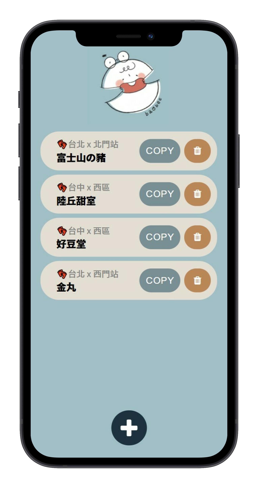
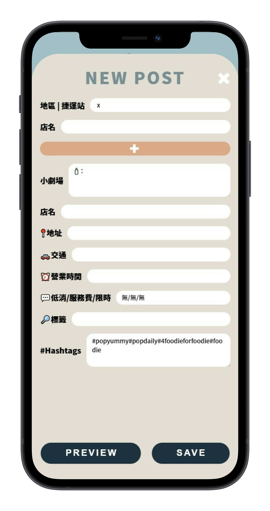

# Post Writer
A native-like PWA tailored to manage posts at [@baobee_foodie](https://www.instagram.com/baobee_foodie/)!  
## Setup
1. Access the hosted [website](https://andy-techen.github.io/post-writer/index.html) with a mobile device (use Safari on iOS, Chrome on Android).
2. Add the site to your homescreen and name the app to your liking.
3. Write, preview, edit, copy, and manage posts with ease!

  
  

